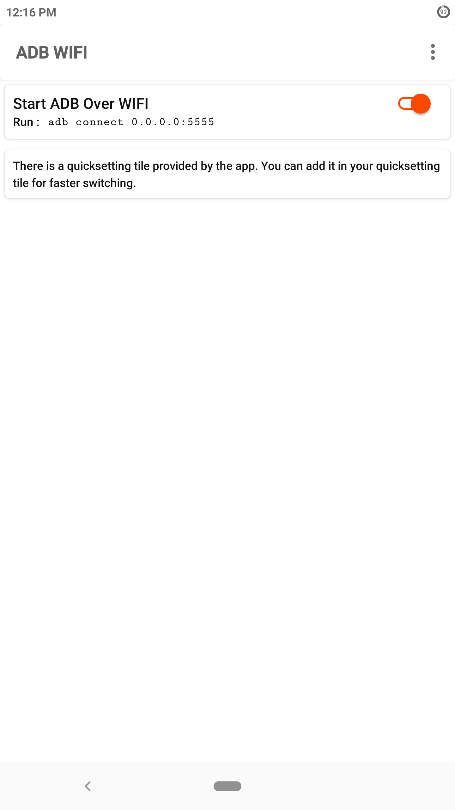

# ADB-WiFi
App to enable ADB (Android Debugging Bridge) over wifi.

##### This app works on ROOTED devices only.

## Features
- Quickly enable/disable ADB connection over WiFi TCP/IP.
- Quick setting tile for quick enabling.
- Dark mode.

## Screenshots 

      <figure>
            
            <figcaption>Quick Setting Tile.</figcaption>
      </figure>
      

            <kbd>
                  
            </kbd>
            <kbd>
                   
            </kbd>
      

## Contributing
1. Fork it (<https://github.com/psuzn/ADB-WiFi>)
2. Create your feature branch (`git checkout -b feature/fooBar`)
3. Commit your changes (`git commit -am 'Add some fooBar'`)
4. Push to the branch (`git push origin feature/fooBar`)
5. Create a new Pull Request
